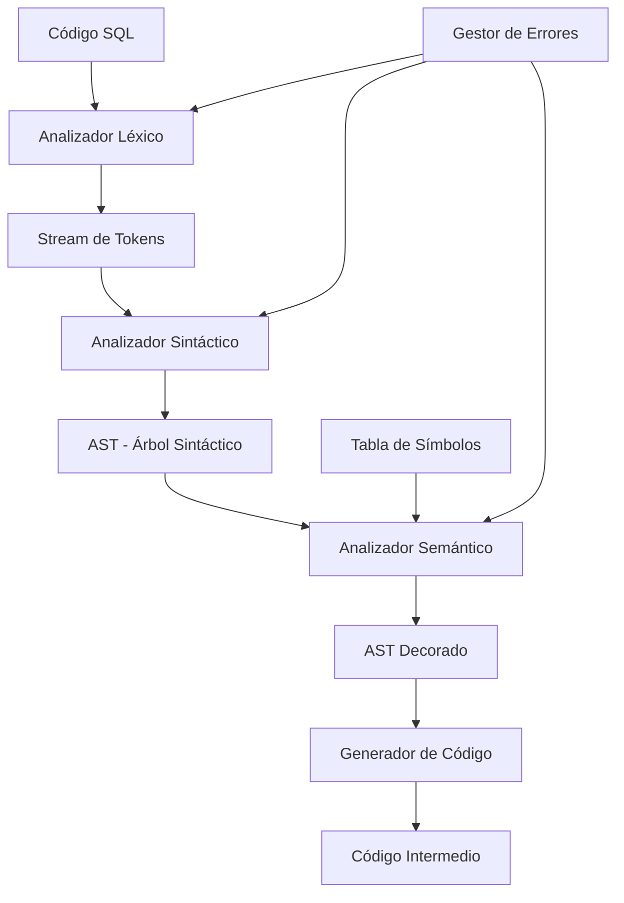

# Compilador SQL - Proyecto Final
## Curso de Compiladores - 7mo Semestre

[](https://isocpp.org/)
[](https://github.com/compilations-teams/compilador-sql-final)
[](LICENSE)
[](tests/)

## 📚 Descripción

Este proyecto implementa un **compilador SQL completo** desarrollado con metodología **Test-Driven Development (TDD)**, diseñado específicamente para el aprendizaje de conceptos fundamentales de compiladores en el 7mo semestre de Ingeniería en Sistemas.

### 🎯 Objetivos Didácticos

1. **Análisis Léxico**: Comprensión de tokens, lexemas, expresiones regulares y autómatas finitos
2. **Análisis Sintáctico**: Dominio de gramáticas libres de contexto, árboles sintácticos y AST
3. **Análisis Semántico**: Validación de tipos, ámbitos, y decoración del AST
4. **Generación de Código**: Traducción a código intermedio y optimización
5. **TDD**: Desarrollo dirigido por pruebas para garantizar calidad y comprensión

## 🚀 Características

- ✅ **Soporte SQL Básico**: SELECT, INSERT, UPDATE, DELETE, CREATE TABLE, DROP TABLE
- ✅ **Análisis Completo**: Léxico, Sintáctico y Semántico
- ✅ **Tabla de Símbolos**: Gestión eficiente de identificadores y tipos
- ✅ **Manejo de Errores**: Reportes detallados con línea y columna
- ✅ **Suite de Tests**: Cobertura completa con Google Test
- ✅ **Documentación Educativa**: Comentarios explicativos en cada fase


### 🪟 Windows 11

#### Opción 1: WSL2 (Recomendado)
1. Instalar WSL2:
   ```powershell
   # PowerShell como Administrador
   wsl --install
   ```

2. Reiniciar y seguir instrucciones de Linux arriba

#### Opción 2: MSYS2/MinGW
1. Descargar e instalar [MSYS2](https://www.msys2.org/)

2. En terminal MSYS2:
   ```bash
   # Actualizar sistema
   pacman -Syu
   
   # Instalar herramientas
   pacman -S mingw-w64-x86_64-gcc mingw-w64-x86_64-cmake mingw-w64-x86_64-gtest make git
   ```


### 2. Compilar el proyecto
```bash
# Compilar todo (compilador + tests)
make all

# Solo el compilador
make compiler

# Solo los tests
make tests
```

## Plataforma Java/Vue para validacion multi-motor

Se agregaron modulos separados para iniciar la migracion/refactorizacion sin romper el compilador C++ existente:

```text
backend/   # Java + Spring Boot
frontend/  # Vue.js + Vite
render.yaml
```

La parte de Jose queda aislada en `backend` y `frontend`. Los modulos de Lexer, Parser y Analisis Semantico no se modifican directamente; el backend expone interfaces en `backend/src/main/java/com/compiladores/sqlplatform/service/compiler` para conectar esas implementaciones cuando esten listas.

### Backend

```bash
cd backend
mvn spring-boot:run
```

Endpoint principal:

```http
POST http://localhost:8080/api/validate
```

Body:

```json
{
  "engine": "SQL",
  "query": "SELECT * FROM usuarios WHERE edad > 18;"
}
```

Respuesta estandar:

```json
{
  "valid": true,
  "engine": "SQL",
  "message": "Query validada con mocks. Pendiente conectar Lexer, Parser y Semantico reales.",
  "errors": [],
  "tokens": [],
  "ast": {},
  "semanticResult": {}
}
```

### Frontend

```bash
cd frontend
npm install
npm run dev
```

La app Vue corre en `http://localhost:5173` y usa `VITE_API_BASE_URL` para cambiar entre backend local y backend desplegado.

### Render

`render.yaml` define dos servicios:

- `sql-platform-backend`: servicio Docker basado en `backend/Dockerfile`.
- `sql-platform-frontend`: sitio estatico generado con `npm run build`.

### 3. Ejecutar tests
```bash
# Ejecutar suite completa
make test

# Con cobertura (si está instalado lcov)
make coverage
```

## 🎮 Uso

### Compilar una consulta SQL
```bash
# Desde archivo
./sql-compiler archivo.sql

# Modo interactivo
./sql-compiler
SQL> SELECT * FROM usuarios WHERE edad > 18;
```

### Ejemplos incluidos
```bash
# Probar ejemplos
./sql-compiler examples/select_basic.sql
./sql-compiler examples/create_table.sql
./sql-compiler examples/complex_join.sql
```

## 🧪 Test-Driven Development

Este proyecto sigue estrictamente TDD. Cada funcionalidad fue desarrollada siguiendo el ciclo:

1. **🔴 Red**: Escribir test que falla
2. **🟢 Green**: Implementar código mínimo para pasar
3. **🔵 Refactor**: Mejorar código manteniendo tests verdes

### Estructura de Tests
```
tests/
├── lexer_test.cpp       # Tests del analizador léxico
├── parser_test.cpp      # Tests del analizador sintáctico  
├── semantic_test.cpp    # Tests del análisis semántico
├── integration_test.cpp # Tests de integración completa
└── fixtures/           # Archivos SQL de prueba
```

### Ejecutar test específico
```bash
# Solo tests del lexer
./tests/lexer_test

# Con verbosidad
./tests/lexer_test --gtest_verbose
```

## 📐 Arquitectura




### Configuración de tareas (`.vscode/tasks.json`)
```json
{
  "version": "2.0.0",
  "tasks": [
    {
      "label": "Build Compiler",
      "type": "shell",
      "command": "make",
      "args": ["compiler"],
      "group": {
        "kind": "build",
        "isDefault": true
      }
    },
    {
      "label": "Run Tests",
      "type": "shell",
      "command": "make",
      "args": ["test"],
      "group": "test"
    },
    {
      "label": "Clean Build",
      "type": "shell",
      "command": "make",
      "args": ["clean"],
      "group": "build"
    }
  ]
}
```

### Configuración de debug (`.vscode/launch.json`)
```json
{
  "version": "0.2.0",
  "configurations": [
    {
      "name": "Debug Compiler",
      "type": "cppdbg",
      "request": "launch",
      "program": "${workspaceFolder}/sql-compiler",
      "args": ["examples/select_basic.sql"],
      "stopAtEntry": false,
      "cwd": "${workspaceFolder}",
      "environment": [],
      "externalConsole": false,
      "MIMode": "gdb",
      "setupCommands": [
        {
          "description": "Enable pretty-printing for gdb",
          "text": "-enable-pretty-printing",
          "ignoreFailures": true
        }
      ]
    },
    {
      "name": "Debug Tests",
      "type": "cppdbg",
      "request": "launch",
      "program": "${workspaceFolder}/tests/all_tests",
      "args": [],
      "stopAtEntry": false,
      "cwd": "${workspaceFolder}",
      "MIMode": "gdb"
    }
  ]
}
```

